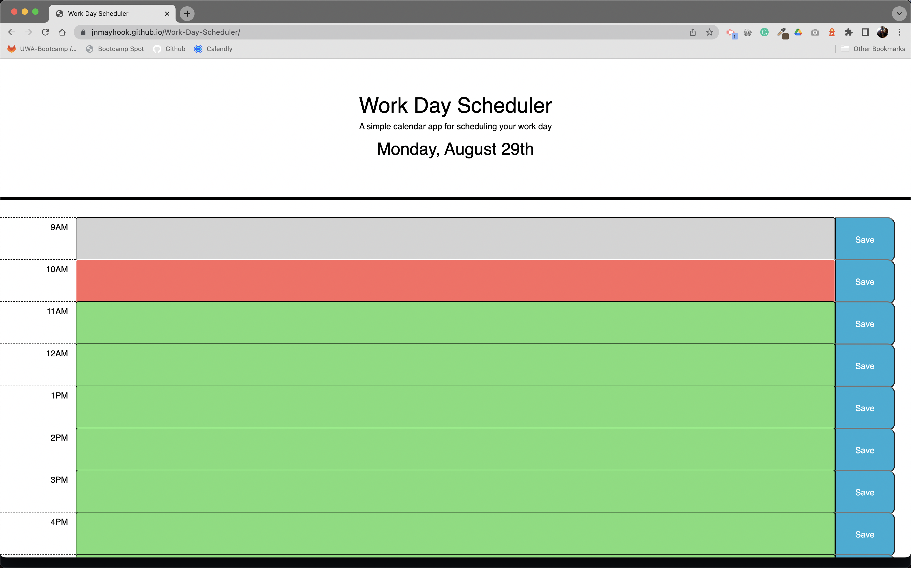

# Work Day Scheduler

## Description
A simple calendar app for scheduling your work day.  Whether you're always on the go with a full plate or begin the day with the paper and look forward to your afternoon soaps, keeping track of your schedule ensures you don't miss an important moment.  This scheduler was built using two well-known JavaScript libraries, JQuery and Moment.  JQuery uses methods to extend JavaScript, and Moment accurately keeps track of time, in this case, from 9a-5p each day.  This app also takes advantage of local storage and saves tasks entered that persist once the page is refreshed. 

[Click here for the deployed app on GitHub.](https://jnmayhook.github.io/Work-Day-Scheduler/)


## Technologies
- HTML5
- CSS/Bootstrap Framework
- Javascript/Node.js
- JQuery
- Moment


## Installation Instructions
```
npm i
```


## Usage Instructions
When a task presents itself, click the desired time block and type out a description and click save.  If you navigate away from the tab or close your web browser, reopen the browser and vist the app, and your tasks will be saved.  


## Screenshots



## License
This project is MIT licensed.


## Questions? 
Please contact me: 

GitHub: [@jnmayhook](https://github.com/jnmayhook)
Email: [jnmayhook@gmail.com](mailto:jnmayhook@gmail.com)

